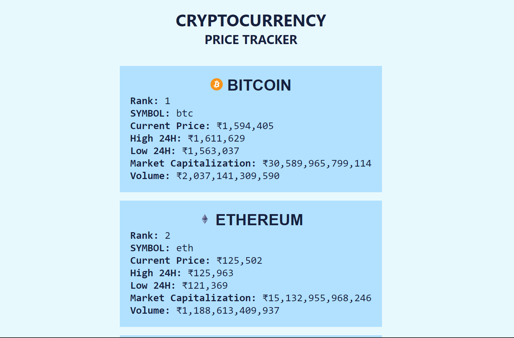

# Cryptocurrency Tracker
  An API-based cryptocurrency price tracker build with Html, Css, JavaScript available for web.  
  It displays recent price value, exchange rate, current market capitalization for over 100+ cryptocurrencies and tokens at real-time.  

## Screenshot

## Technology Used :
- **HTML**
- **CSS**
- **JAVASCRIPT**
- **API** (CoinGecko)

**Website Link** : [subrotokumar.github.io/cryptocurrency-tracker](https://subrotokumar.github.io/cryptocurrency-tracker/)